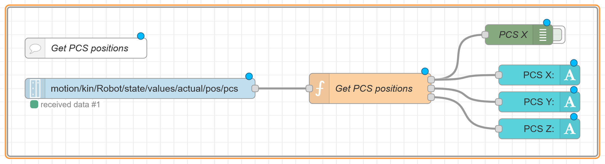
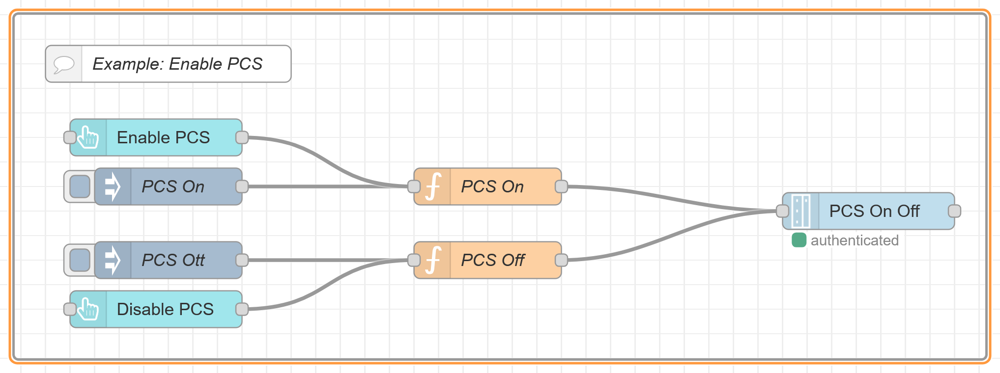

<h1 align="left">
  <br>
  
  <br> Advanced Automation Lab 03
  <br>
</h1>

Author: [Cédric Lenoir](mailto:cedric.lenoir@hevs.ch)


# AAut-rob_2026

## More about PCS with Node-RED


PCS access is done directly thru datalayer.

### Reading PCS positions

```datalayer
motion/kin/Robot/state/values/actual/pos/pcs
```

<div align="center">
    
    <figcaption>Get PCS position from datalayer</figcaption>
</div>

Using the struct of PCS in Node-RED

```js
var msg_x_pos = {payload: Math.round(msg.payload.pos[0] * 100) / 100};
var msg_y_pos = {payload: Math.round(msg.payload.pos[1] * 100) / 100};
var msg_z_pos = {payload: Math.round(msg.payload.pos[2] * 100) / 100};

return [msg_x_pos,
        msg_y_pos,
        msg_z_pos];
```

---

### Enabling PCS

<div align="center">
    
    <figcaption>Enable PCS from Node-RED</figcaption>
</div>

```js
// PCS On
var newMsg = {};
newMsg.payload = {
    "type":"object",
    "value": {
        "permType":"PermOn",
        "setName": "Pcs_1"
    }
}

return newMsg;
```

```js
// PCS Off
var newMsg = {};
newMsg.payload = {
    "type":"object",
    "value": {
        "permType":"PermOff",
        "setName": "Pcs_1"
    }
}

return newMsg
```

```js
// Write to
motion/kin/Robot/cmd/opt-pcs
```

### Using a PCS set
It means that PCS should be configured on the PLC/Motion


#### Default values on Unit 01


<!-- End of document -->


