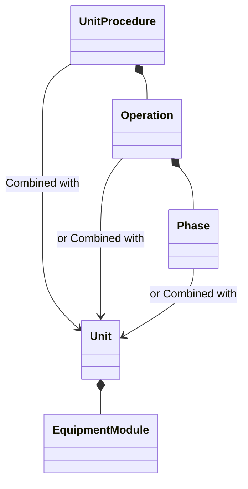
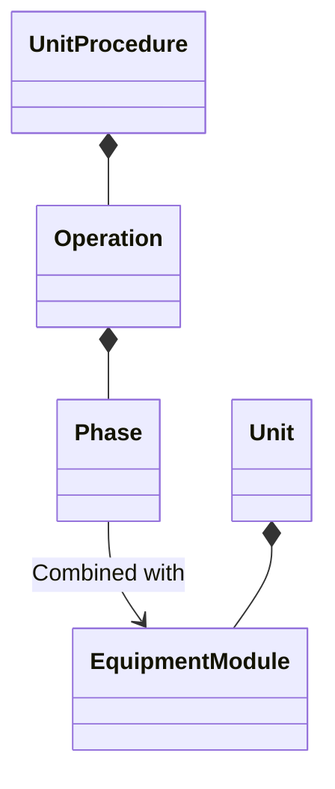

<h1 align="left">
   
  
    Advanced Automation Lab 03
   
</h1>

Author: [Cédric Lenoir](mailto:cedric.lenoir@hevs.ch)

# Controlling equipment via OPC-UA

## Preamble
This lab was developped for a robotic lab with camera calibration using a QR-Code. Most of the files on this repository are not directly dedicated to this lab. See [Robotics for details](./Robotics).

## Version
CtrlX PLC 3.6.3

## S-88, *IEC 61512*, A few reminders

Let's consider a unit composed of several pieces of equipment, at least one robot, as shown here. There are several ways to control the equipment modules.

Either, within an integrated machine, commands are sent to the machine, which then manages its equipment.

That is to say: the unit is controlled using a procedure composed of operations, themselves composed of phases.
  :heavy_exclamation_mark:  Or, it is controlled using operations.
  :heavy_exclamation_mark:  Or, it is controlled using phases.

:bangbang: In this situation, a command is sent to the machine, and it is the machine, the Unit, that will send the commands to the equipment.

:bulb: *Associations represent relationships between the objects of one class and the objects of another.*

## Goal of the lab

Either we have a system where the equipment modules no longer depend on the machine, Unit, but can be controlled directly from an external system.

:bulb: Equipment modules may execute equipment phases but they do not have the capability of executing higher level procedural elements.

In this lab, we suppose that we want to control diretctly the Equipment Modules using OPC-UA. To test the functionalities, we will use Node-RED with the 

<!-- End of file>