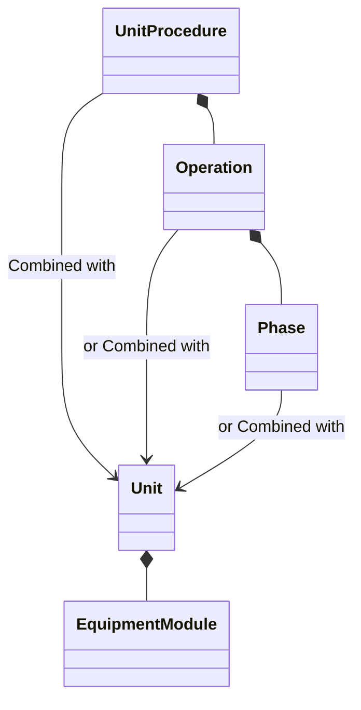
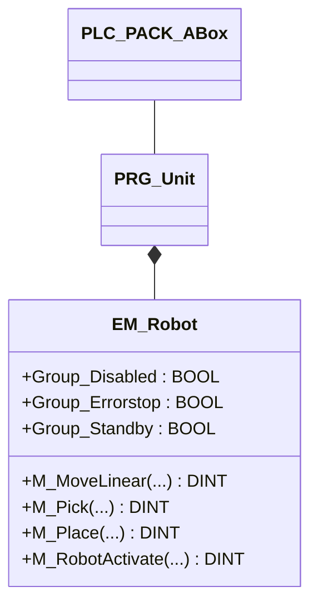

<h1 align="left">
  <br>
  
  <br> Advanced Automation Lab 03
  <br>
</h1>

Author: [Cédric Lenoir](mailto:cedric.lenoir@hevs.ch)

required : UA Expert client


## Version
CtrlX PLC 3.6.3

# Base
This lab is based on [Rob AAut, see this repo for details](https://github.com/hei-synd-aaut/rob_lab_01_2026).

# Controlling equipment via OPC-UA

:warning: <b style='color:red;'>Using OPC-UA, you will have to enter manually velocity and acceleration, be carfull with that</b>

- X Range about -250 to 250 [mm]
- Y Range about -150 to 150 [mm]
- Z Range about -100 to 100 [mm]
- Velocity: about 0.1 [m/s]
- Acceleration: about 1 [m/s2]


## S-88, *IEC 61512*, A few reminders

Let's consider a unit composed of several pieces of equipment, at least one robot, as shown here. There are several ways to control the equipment modules.

Either, within an integrated machine, commands are sent to the machine, which then manages its equipment.

That is to say: the unit is controlled using a procedure composed of operations, themselves composed of phases.
  :heavy_exclamation_mark:  Or, it is controlled using operations.
  :heavy_exclamation_mark:  Or, it is controlled using phases.

:bangbang: In this situation, a command is sent to the machine, and it is the machine, the Unit, that will send the commands to the equipment.


```mermaid
classDiagram
Unit Procedure *-- Operation
Operation *-- Phase

Unit Procedure --> Unit : Combined with
Operation --> Unit : or Combined with
Phase --> Unit : or Combined with

Unit *-- Equipment Module

```

:bulb: *Associations represent relationships between the objects of one class and the objects of another.*

:bulb: Equipment modules may execute equipment phases but they do not have the capability of executing higher level procedural elements.

Either we have a system where the equipment modules no longer depend on the machine, Unit, but can be controlled directly from an external system.

---

## Goal of the lab

We have the following system:

<div align="center">


```mermaid
classDiagram

PLC_PACK_ABox -- PRG_Unit
PRG_Unit *-- EM_Robot

    class EM_Robot{
        +Group_Disabled : BOOL
        +Group_Errorstop : BOOL
        +Group_Standby : BOOL
        +M_MoveLinear(...) DINT
        +M_Pick(...) DINT
        +M_Place(...) DINT
        +M_RobotActivate(...) DINT
    }

```
</div>

It is assumed that we want to control the robot directly at the equipment level from an external system via OPC-UA. For example, a Siemens PLC with an OPC-UA client.

---

# Your job

You are asked to perform some preliminary tests to verify:
  1. It is possible to control the robot directly from an external system via OPC-UA. That is, to use its methods.
  2. It is possible to control the unit directly using the functionalities of PackML combined with OPC-UA.

You won't be able to test everything, so select a few relevant examples, then:
  1. Explain what you will test, typically one or two functionalities of the FS, **Functional Specification**. Approximately $45 \, minutes$.
  2. Set up your tests, describing what you are doing in the form of a diagram or code. Approximately $2 \times 45 \, minutes$.
  3. Reserve about $45 \, minutes$ to test what you have implemented, what works and what doesn't.
  4. A paragraph addressing OT security aspects is expected.
  5. You have until <b style='color:red;'>Tuesday, April 28 at 11:59 p.m.</b> to submit your work.

## Tools at your disposal.
  1. The robot project in ``/plc/CtrlX-lab-rob_2026_V_3_6.projectarchive``
  2. The Node-RED instance of the previous project in ``/NodeRed/flows.json``.
  3. A simplified project in ``/NodeRedUaHandsOn/CtrlX-lab-Ua_2026_V_3_6.projectarchive`` with the corresponding ``flows.json`` file.
  4. UA Expert should be installed on your lab PC.

:bulb: We recommend working with the simplified project, which will likely allow you to quickly test certain technical aspects without being burdened by the associated hardware. This is a POF, Proof of Concept.

---

## annexes

### About Set Get
Try to use OPC UA to read/write attribute.

With 

```iecst
{attribute 'monitoring':= 'variable'}
PROPERTY Group_Disabled : BOOL
```

With

```iecst
{attribute 'monitoring':= 'call'}
PROPERTY Group_Disabled : BOOL
```

### About WSTRING
What does WSTRING means ?

Can you display that ``안녕하세요`` in your OPC-UA Test Tool ?
And with Node-RED ?

<!-- End of file>